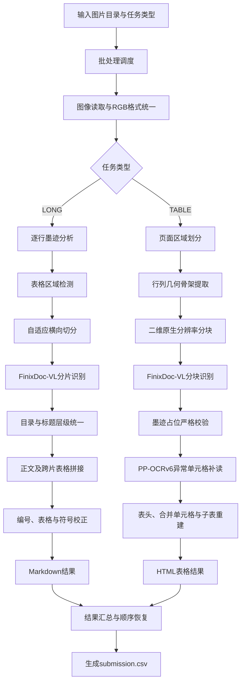
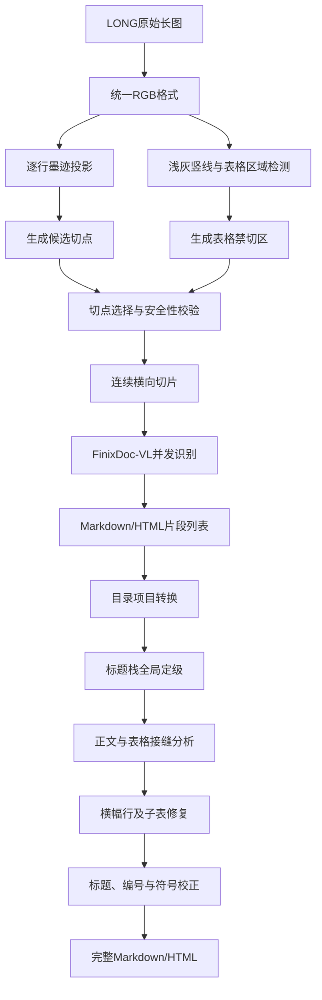
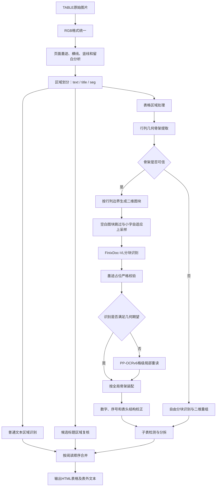

# 基于几何锚定的视觉大模型与轻量模型协同的复杂金融文档还原方案

**方案名称：GeoAnchor —— 基于几何锚定的视觉大模型与轻量模型协同的复杂金融文档还原方案**（AFAC2026 挑战组赛题二）

## 1. 任务理解与设计目标

赛题要求把超长金融文档和超大复杂表格图片还原为 Markdown/HTML。难点不只是文字识别，还包括长图切分后的语义连续、标题层级统一、跨块表格拼接、复杂表头及合并单元格恢复。本方案的目标是在赛题指定 FinixDoc-VL API 能力不变的条件下，通过工程化处理提高内容召回、结构准确性、运行稳定性和结果可解释性。

## 2. 总体方法

### 2.1 总体设计思路

系统采用“版面分析、多模态识别、几何约束、局部纠错、全局校正”的协同框架。FinixDoc-VL 负责识别文字和理解复杂语义；几何算法负责确定切分位置、阅读顺序和表格行列；PP-OCRv6 small 只处理严格校验失败的单元格；最终由确定性规则完成跨块合并、标题定级、表头重建和格式统一。

### 2.2 系统架构

系统采用分层、分支式架构。首先由批处理入口读取图片路径和任务类型，对图像进行统一预处理；随后按照数据集给定的 `LONG` 或 `TABLE` 类型进入相应处理分支。两条分支共享 FinixDoc-VL API 调用、缓存、异常检测和重试机制，但在图像切分、结构约束和结果重建方法上相互独立。最终，两个分支的结果统一转换为字符串，按照原始文件顺序写入提交文件。

系统架构如下。



### 2.3 环境条件


## 3. LONG 长文档还原算法

### 3.1 LONG技术路线概述

LONG 分支采用“几何感知切分、多模态分片识别、确定性全局重建”的技术路线。其关键不是简单地把长图分成若干小图，而是在切分前控制结构破坏风险，在切分后重新建立被局部识别打断的文档上下文。

整条技术路线可划分为六个阶段：

1. **输入规范化**：读取超长图片并统一为 RGB 格式，保留浅灰文字、细线及小字符信息；
2. **几何感知**：计算逐行墨迹量，同时检测带边框表格在原图中的纵向范围；
3. **自适应切分**：以约 5000 像素为基础尺度，在目标位置附近寻找低墨迹切点，并对可完整容纳的表格进行避让；
4. **分片识别**：将各横向切片并发发送至 FinixDoc-VL，得到 Markdown/HTML 片段；
5. **全局重建**：统一目录与标题层级，恢复被截断的正文句子，合并跨切片表格；
6. **结果规范化**：修复表格横幅行和连续子表，补回漏标标题，统一编号序列、罗马数字、上下标和公式格式。



### 3.2 输入规范化

系统首先读取原始长图，并将其统一转换为 RGB 图像对象。默认流程不执行整图缩放、强二值化、锐化或重度降噪，目的是保留浅灰文字、细表格线、小数点、上下标以及字符抗锯齿信息。对于超大图片，程序解除图像库的默认像素数量限制，使其能够完整加载赛题中的极端长图。

### 3.3 几何感知

几何感知阶段只分析图像结构，不直接修改模型输入。系统将 RGB 图片临时转换为灰度矩阵，并分别提取两类信息：

- **水平墨迹信息**：统计每一行中的暗像素数量，用于判断文字行、段落空白和候选切点；
- **表格竖线信息**：寻找局部范围内近似贯通的浅灰竖线，用于估计带边框表格的纵向覆盖区间。

两类信息最终共同参与切点决策。水平墨迹决定“哪里适合切”，表格区域决定“哪里不能轻易切”。这种方式避免只依赖空白带，因为表格行之间同样存在大量空白，单独使用空白判据容易在表格内部落刀。

### 3.4 自适应切分

系统以 5000 像素作为期望切片高度，但不将其作为固定边界。对于每一个目标位置，算法在前后 500 像素范围内搜索墨迹最少的水平行，并优先选择距离目标位置最近的完全空白行。

候选切点生成后还需经过表格避让和最小高度校验：

- 切点不在表格内：直接采用候选切点；
- 切点位于短表格内：尝试移动到表格上方的最近空白位置；
- 切点位于高度超过单片范围的长表格内：不强行移动，由后续续表拼接恢复；
- 调整后与上一切点距离不足 800 像素：取消调整，防止形成异常短片。

最终切片是首尾连续、互不重叠的原图裁剪。该设计保留了原始分辨率，也使后续普通正文无需执行高风险的模糊去重。

### 3.5 分片识别

各切片按照原始顺序构成任务列表，并通过统一 API 层并发调用 FinixDoc-VL。模型负责识别：

- 普通正文和段落换行；
- Markdown 标题及其局部层级；
- 目录、列表和编号；
- 表格及 HTML 行列结构；
- 公式、上下标和特殊字符。

每个切片独立识别，不共享上一切片的文字、标题栈或表头。因此，模型输出中的 `#` 数量和 `<table>` 边界只能视为局部结果，不能直接作为完整文档结构使用。

API 层同时处理缓存、错误信封、HTML 错误页、空结果、表格截断和模型复读退化。正常片段才会进入后续重建阶段，从而减少外部服务波动对整篇文档的影响。

### 3.6 全局重建

全局重建阶段按照“先标题、后接缝、再整体校正”的顺序执行。

首先，系统识别目录区域，将目录中的带编号列表项转换为候选标题。随后汇总全部切片标题，根据章节编号、父子路径、同序列相邻关系和标题栈重新计算全局层级。该步骤只修改 Markdown 标题符号的数量，不改变标题文本。

其次，系统顺序分析相邻切片接缝：

- 对未以完整标点结束的正文，与下一片首行直接续接；
- 对上一片闭合表格、下一片重新开启表格的情况，删除内部标签并继续拼接表格行；
- 对接缝附近少量被模型识别到表外的单元格文字，根据位置、长度、标点和列数恢复到表格内部；
- 对新标题、新列表或新段落保持原有块边界。

最后，在整篇文档范围内修复表格横幅行、拆分连续子表、推断漏标标题并统一编号序列。

### 3.7 结果规范化

全局结构确定后，系统按照训练数据和评测格式执行低风险文本规范化：

- 在医学等级和分期语境中将 ASCII 罗马数字转换为 Unicode 罗马数字；
- 将 Unicode 上下标压平为普通字符；
- 将模型生成的 LaTeX 公式转换为纯文本表达；
- 压缩多余空行，保持 Markdown 和 HTML 标签完整。

经过该阶段后，输出成为一篇单一字符串形式的 Markdown/HTML 文档，可直接写入提交文件的 `ground_truth` 字段。

### 3.8 各技术组件的职责边界

| 技术组件 | 主要职责 | 不负责的内容 |
|---|---|---|
| 图像几何算法 | 墨迹统计、表格区检测、切点决策 | 不识别文字语义 |
| FinixDoc-VL | 正文、标题、列表、表格和公式识别 | 不保证跨切片层级一致 |
| 标题栈 | 统一全局标题层级 | 不修改标题文字 |
| 接缝分析器 | 恢复断句和跨片表格 | 不重写正常完整段落 |
| 表格后处理 | 横幅行修复、连续子表拆分 | 不重新识别单元格 |
| 格式规范化 | 对齐评测标注风格 | 不改变文档章节结构 |

### 3.9 算法特点与局限

LONG 算法的主要特点是将多模态模型的局部内容理解能力与确定性结构算法结合：图像几何负责控制切分风险，模型负责识别片段内容，标题栈和接缝规则负责恢复全局结构。该方法不需要训练额外的大模型，具有较好的可解释性和工程可控性。

目前表格禁切区域主要依赖竖直边框，对无框表的保护能力有限；高度超过单个切片范围的表格仍需依赖模型输出的 HTML 结构进行恢复；对于完全无编号且版式相近的标题，层级判断证据相对不足。此外，系统暂未显式建立“见第X条”“参见附表”等文内引用关系图，只保留原始引用文字。

## 4. TABLE 复杂表格算法

### 4.1 TABLE总体技术路线

TABLE 分支采用三阶段主体结构：

1. **页面结构分析与区域划分**。分析页面结构，将页面拆分为普通文本、标题和表格区域；
2. **表格识别**。对表格区域建立行列骨架、生成二维图块、调用 FinixDoc-VL，并对异常图块执行格级本地补读；
3. **结构合并**。按照页面阅读顺序合并文本、表头碎片和表格，恢复合并单元格、连续子表及最终 HTML。

在主体结构之外，系统还设置了骨架失效回退、API 截断重读、空白块跳过和多级缓存机制，用于处理规则表、无框表、密集表、并排表及异常服务响应。

具体结构如下：



### 4.2 页面结构分析与区域划分

复杂表格图片不一定只包含一张完整表格，还可能包含：

- 表格上方的主标题、副标题和单位；
- 表格之间的分组说明；
- 页眉、页脚、页码和水印；
- 多张上下排列的子表；
- 左右并排的多个面板；
- 被横线或留白分隔的独立表格区域。

因此，系统不会直接把整张图片当成一张表，而是先分析横线、竖线、文字墨迹、连通区域和留白带，将页面划分为有序区域块：

```text
text   普通文本、页眉页脚或表间说明
title  从表格上方剥离的候选标题
seg    已通过结构判定的表格区域
```

区域判定使用可解释的几何条件。系统估计候选区域的行数、列数、单元格数量以及墨迹横向覆盖范围，并采用以下结构公式识别明显的非表格区域：

```text
单元格数 < 30
或
(行数 < 4 或 墨迹横向跨度 < 区域宽度的50%) 且 单元格数 < 200
```

满足上述条件的区域更可能是标题、说明文字或噪声，进入 `text` 路径；只有具备足够二维结构的区域才作为 `seg` 进入表格识别。这样可以防止普通文字被强行包装成空表格，也能减少标题区域进入格级切分后被拆碎。

对于已经判定为表格的区域，系统进一步检查顶部是否存在连续的非数据行。如果顶部行不像数据行，而下方出现横向铺开的多列数据，则将顶部区域暂时剥离为 `title`。后续识别会再次判断该区域究竟是真标题，还是误剥离的表头或数据行，从而形成“几何初判、识别复核”的双重保护。

所有区域最终按照纵坐标和横坐标排序，保留页面原始阅读顺序。

### 4.3表格识别

#### 4.3.1 行列几何骨架提取

对于每个 `seg`，系统分别检测行边界和列边界，形成全局几何骨架：

```text
rb = [y0, y1, y2, ..., yR]    行边界
cb = [x0, x1, x2, ..., xC]    列边界
```

相邻两个行边界与列边界共同定义一个单元格区域：

```text
cell(i,j) = [rb[i], rb[i+1]) × [cb[j], cb[j+1])
```

骨架检测针对两类表格分别处理：

- **有框表**：优先利用连续横线、竖线和框线覆盖率确定行列边界；
- **无框表**：主要利用文字墨柱、行间白缝、列间白缝和墨迹跨度推断边界。

骨架生成后，还会执行两类修复。

第一类是漏检列线修复。当一个宽列中出现多个稳定的墨迹区带，且不同数据行中的区带间隙具有较高对齐度时，说明可能有两列被合并。系统会结合局部识别证据判断是否插入新列边界。

第二类是幻影窄列清理。如果某一列宽度显著小于中位列宽，同时该窄列几乎没有独立墨迹，说明它可能只是跨列文字、残余线条或错误白缝产生的伪列。系统会删除相应边界，将窄条并回相邻真实列。

系统还会检测行列是否严重错位。若全表行结构与局部列带中的行结构明显不一致，说明当前几何骨架不可信，此时不继续执行严格骨架装配，而是转入自由分块识别与二维重组回退路线。

#### 4.3.2 二维原生分辨率分块

对于可信骨架，系统根据行边界和列边界生成二维图块。图块严格在单元格边界处裁剪，不从字符内部落刀。

当前核心约束为：

```text
每个图块最多25行
每个图块最多15列
图块安全长宽比不超过180:1
```

如果表格包含 58 行、24 列，则可被划分为约 3 个行带和 2 个列带，形成 6 个二维图块。各行带和列带采用相对均匀的分配方式，避免出现“前面图块很满、最后图块只有少数行列”的碎尾现象。

系统使用原图分辨率裁剪图块，而不是先缩小整张表格。其原因是 FinixDoc-VL 对超宽或超大图片可能进行内部降采样，导致小数字、小数点和百分号模糊。二维原生分辨率分块使每次识别只观察局部区域，从而保持单元格文字的有效像素尺寸。

图块生成后执行两项优化：

1. **空白块跳过**：若图块中的浓墨和淡墨证据均表明其为空白，则不调用 API，后续直接依据骨架补空单元格；
2. **密集小字上采样**：根据平均单元格边长估计文字密度。当单元格过小时，将图块放大到目标格边长约 55 像素，最大放大 3 倍。

图块四周增加少量白色边缘，为模型提供视觉余量，但不会携带相邻图块中的内容，避免跨块残影和重复识别。

#### 4.3.3 FinixDoc-VL局部内容识别

所有非空图块通过统一 API 层并发调用 FinixDoc-VL。模型返回局部 Markdown/HTML，系统从中解析：

- 表格前的候选标题或说明；
- `<tr>` 表格行；
- `<td>`或`<th>`单元格；
- 模型识别出的局部行列内容。

此阶段只负责“读取”，不立即修复行数或列数。原因是模型可能出现以下典型退化：

- 将多行内容压缩成少数行；
- 对重复数字连续复读，造成爆行；
- 将二维表格展平成一行多列；
- 漏掉空白单元格，使后续内容左移；
- 把跨列表头识别为表外标题；
- 输出超过长度上限，造成 `<table>` 标签未闭合。

如果在读取阶段混入大量特判，会使局部规则互相干扰。因此，当前主路线将“读取”和“判定”分离：模型输出先原样解析，随后统一进入严格校验。

#### 4.3.4 墨迹占位严格校验

系统从原始 `seg` 图像中计算每个几何单元格的浓墨和淡灰墨迹证据，并据此确定：

```text
哪些骨架行应当包含内容
每一行中哪些骨架单元格应当非空
哪些单元格应当保持空白
```

设某个图块根据原图得到的期望为：

```text
第1行：[有字, 有字, 空, 有字]
第2行：[有字, 空,  空, 有字]
```

模型识别结果只有在以下条件同时成立时才被直接接受：

1. 模型识别出的非空行数量与几何期望行数量完全一致；
2. 每个位置的“有内容或空白”状态与原图墨迹证据一一对应；
3. 模型没有在骨架范围之外额外生成有内容的单元格。

例如：

```text
原图期望：[有字, 空, 有字]
模型结果：[文本A, 文本B, 文本C]
```

即使行数和列数看似正确，第二格也属于无墨迹幻觉，因此整个图块不能直接通过。

这种判定方式不依赖模型置信度，而是将识别结果与原始图像的物理证据进行对照。它能够统一发现漏行、错位、空格消失、复读填充和幻觉内容等问题。

#### 4.3.5 PP-OCRv6格级局部重读

当图块未通过严格校验时，系统不重新调用多模态模型识别整张大表，而是将位置控制权完全交给几何骨架。对于该图块中根据墨迹证据应当含有内容的普通单元格，系统按几何坐标逐格裁剪，并调用 PP-OCRv6 small recognition-only 模型读取文字。

该本地模型约 7.7M 参数，通过 ONNX Runtime 在 CPU 上运行，不负责文字检测，也不判断行列位置。其输入是已经由几何骨架确定的单元格裁剪，输出只是该格中的文本。因此，多模态模型在重复内容区域出现的跳行、复读和位置漂移，在逐格识别中结构性地被消除。

对于表格顶部跨越多个列边界的标题或说明行，逐格裁剪会把完整文字切碎。系统会检测文字笔画是否横穿内部列边界；若确有跨列笔画，则将连续单元格合并成一条图像带进行整体识别，并把结果放在起始单元格中，后续再由表头重建模块生成 `colspan`。

本地 OCR 只在严格校验失败的图块中触发。正常图块继续采用 FinixDoc-VL 结果，从而保留多模态模型对复杂中文、特殊符号和表头语义的识别优势，同时控制 CPU 推理成本。

#### 4.3.6 全局网格装配与内容校正

图块通过校验或完成局部补读后，系统按照其对应的行带、列带位置，将局部结果写入全局二维网格：

```text
grid[global_row][global_col] = cell_text
```

所有行号和列号均来自几何骨架，而不是模型自行输出的序号。对于原图确定为空白的区域，即使没有调用 API，也会在全局网格中补入空字符串，以保持完整的二维结构。

全局装配完成后，系统执行两类内容校正。

第一类是数字格式归一。局部 OCR 可能把千分位逗号、小数点或分隔符识别成不同形式，系统根据同一列中多数数字的格式模板调整分隔符，但不改变数字字符的排列和位数。

第二类是序号补洞。系统只在高置信的行号列和列号行中检查连续整数序列。如果连续序列中缺少单字符数字，或数字内容正确但格式异常，则根据相邻序列进行补齐和规范化。该规则限制在表格前 4 列及可信列号行中，避免对普通财务数字进行错误推断。

#### 4.3.7 复杂表头与合并单元格重建

模型在局部图块中可能把跨列表头识别为普通行、表外标题或多个重复单元格。系统利用表格前部的列号行、文字分布和跨列范围恢复表头结构。

主要处理包括：

- 将列号行上方的说明行转换为整行 `colspan` 标题；
- 将左侧纵向标签恢复为 `rowspan`；
- 将覆盖多个数据列的表头恢复为 `colspan`；
- 将斜线表头或悬浮轴标签折入角单元格；
- 将无框表顶部的单格标题弹出为表前文本；
- 使用内部占位符暂存 `rowspan` 和 `colspan`，在生成 HTML 时转换为真实属性。

表头重建只在前部行满足明确结构特征时触发。若首行表现为普通数字数据，则保持平面单元格形式，避免将数据误判为表头。

#### 4.3.8 子表识别与分拆

一张 TABLE 图片中可能包含多张上下排列的子表。系统综合使用页面分区、候选标题、非首带 caption 和列号轴行识别子表边界。

当模型在非首图块中识别出新的标题，同时对应行带中出现连续列号序列，说明下方很可能开始了一张新表。系统在相应位置拆分全局网格，并将边界附近少量中文说明行提取为表间文本。

对于步骤一错误剥离的表头或数据行，识别阶段会将其标记为表格碎片 `tfrag`。步骤三会优先把 `tfrag` 拼回紧随其后的表格顶部；若没有可合并的下方表格，则降级为普通文本，避免生成孤立的小假表。

#### 4.3.9 骨架失效与异常回退路线

严格骨架路线适用于大多数规则表格，但当行列边界严重错位时，错误骨架会把正确文字放入错误单元格。为避免在错误坐标系中继续执行局部 OCR，系统会提前标记 `rows_misaligned`，并转入自由分块识别路线。

自由路线仍然在原始分辨率下按二维区域切块，但不强制使用严格行列骨架装配，而是解析模型返回的局部表格并进行二维拼接。对于以下高置信异常图块，还会执行方向性拆半重读：

- 一两行却包含大量列：优先沿竖直方向拆分；
- 表格标签未闭合或行数严重不足：优先沿水平方向拆分；
- 第一次修复仍失败：尝试另一方向；
- 修复后通过结构检查：将完整结果写回缓存。

回退路线的目标不是取代主路线，而是在几何证据不足时防止严格规则产生确定性的错误结果。

### 4.4 页面级结构合并

完成单个 `seg` 的识别后，系统得到普通文本、候选标题、表格网格和可选原始 HTML 等中间结果。接下来按照页面阅读顺序执行合并。

如果一个小表格位于大表格正上方，单元格数量不足下方表格的八分之一，且二者列数差不超过 6，则将上方小表判断为被竖线断裂剥出的表头条，合并到下方表格顶部。

对于“表头小条、短文本、表身”三段结构，如果中间短文本符合表头说明特征，则将其转换为满宽横幅行，与上下两段共同合并为一张表。

普通文字块会剥离 HTML 标签、保留必要段落边界，并与表格按照原始阅读顺序排列。最终，二维网格被序列化为 HTML：

```html
<table>
  <tr>
    <td rowspan="2">项目</td>
    <td colspan="3">保单年度</td>
  </tr>
  ...
</table>
```

### 4.5 技术组件职责划分

| 技术组件 | 主要职责 | 核心价值 |
|---|---|---|
| 页面分区算法 | 区分文本、标题和表格区域 | 防止非表内容进入网格识别 |
| 行列几何骨架 | 确定全局行列和单元格坐标 | 解决模型计数与位置漂移 |
| 二维原生分块 | 控制输入尺寸并保留小字分辨率 | 降低内部降采样损失 |
| FinixDoc-VL | 识别复杂中文、数字和表头语义 | 提供主要内容识别能力 |
| 墨迹占位校验 | 判断识别结果是否符合原图 | 提供可解释的质量门 |
| PP-OCRv6 small | 重读不合格图块中的具体单元格 | 消除重复区域跳行和复读 |
| 表头重建算法 | 恢复`rowspan`、`colspan`和角格 | 提高HTML结构准确性 |
| Stage III合并 | 合并表头碎片、子表和表外文本 | 恢复页面级阅读结构 |
| 回退路线 | 处理严重错位或异常图块 | 避免单一路线失效 |

#### 4.6 路线特点

TABLE 技术路线的核心特点可以概括为：

1. **先确定结构，再识别内容**：用几何骨架限制模型输出的空间位置；
2. **原生分辨率二维分块**：避免超宽整图降采样导致密集数字不可读；
3. **模型结果必须接受图像证据校验**：不以“HTML格式完整”作为唯一正确标准；
4. **异常修复局部化**：仅对不合格图块执行格级 OCR，降低重复推理成本；
5. **主路线与回退路线并存**：骨架可信时追求结构稳定，骨架失效时保留模型自由识别能力；
6. **页面级输出重建**：不仅恢复单张表，还处理标题、表间说明、子表和阅读顺序。


## 6. 参数设置

| 类别 | 参数 | 设置 |
|---|---|---:|
| LONG | 基础切片高度 | 5000 px |
| LONG | 切点搜索半径 | 500 px |
| LONG | 最小尾段高度 | 800 px |
| LONG | 表格线阈值/最少竖线 | 245 / 3 |
| TABLE | 浓墨/淡墨/线阈值 | 128 / 180 / 170 |
| TABLE | 单块最大行列 | 25 × 15 |
| TABLE | 安全长宽比 | 180 |
| TABLE | 上采样目标/上限 | 55 px / 3 倍 |
| API | 失败重试/退避上限 | 3 次 / 8 秒 |
| API | 复读额外重试 | 1 次 |
| 入口 | 图级进程数 | 6 |
| 入口 | 默认请求超时 | 240 秒 |
| 当前源码 | 每进程线程池上限 | 32 |

## 7. 推理时间与资源预估

本地仅使用 CPU，不需要 GPU。建议 8 核以上 CPU、16GB 内存，处理极端大图时建议 32GB 以上。历史标定中，1500×5000 的 LONG 切片约 13 秒；不同高度 LONG 切片约 8～27 秒。100 张图片的历史完整运行约 47～54 分钟。考虑共享 API 波动、失败重试和缓存未命中，保守估计完整评测需要 60～110 分钟，建议按 2 小时规划并预留至 3 小时。该数据需在最终比赛环境中进行无缓存复测。

## 8. 迭代过程

初始 Baseline 使用固定等高切分、独立 API 识别和直接字符串拼接，历史本地综合分约 71.1，LONG 约 92.5，TABLE 约 49.7。随后依次完成：

1. LONG 空白带切分、接缝去重、目录转换和标题层级统一；
2. TABLE 从整图/行带改为二维原生分辨率分块，解决内部降采样造成的小数字漏读；
3. 引入多子表检测、表外文字处理、并排面板拆分和截断块重读；
4. 以图像行列骨架替代模型返回的行列计数，解决密集表少行、爆行和展平；
5. 引入墨迹占位严格校验和 PP-OCRv6 small 格级补读；
6. 重建表头、序号、幻影窄列，并增强 API 复读退化检测与缓存。

历史记录中的完整本地评测最高为 83.2，其中 LONG 92.6、TABLE overall 73.8、TABLE TEDS 64.2。此后代码仍有重构和增强，最终结果应以当前版本重新全量评测为准。

## 9. 模型与 Ensemble 声明

本方案未训练或微调 FinixDoc-VL，也未采用多个大模型投票、加权或级联 ensemble。PP-OCRv6 small 使用公开预训练 recognition-only 权重，未基于赛题数据继续训练，只在结构校验失败时局部补读。因此不存在多个单模型训练结果和 ensemble 权重需要报告。

## 10. 创新点、局限与拓展

创新点包括：表格感知的长图切分、跨片段语义与表格接缝恢复、语义识别与空间定位解耦、墨迹占位恒等校验、残差单元格轻量补读，以及面向 API 截断和复读退化的工程化防护。

当前局限包括无框表保护较弱、几何骨架错误会传递到局部识别、极端畸形 HTML 修复能力有限，以及缺少完整的自动化测试。后续可引入全局并发控制、表头与首列锚点注入、轻量结构置信度模型、跨页引用关系恢复和提交前完整性硬校验，并探索基于候选结构评分的轻量自一致性。
